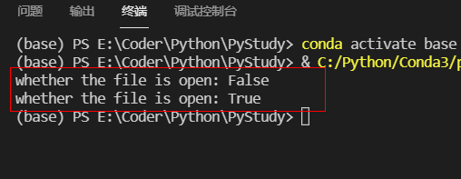
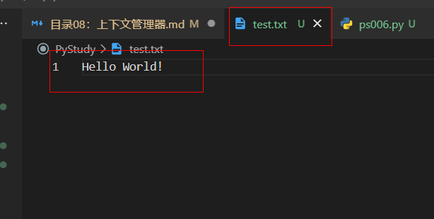
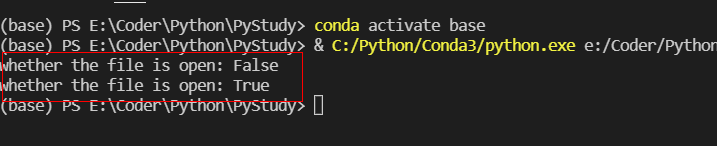

# 下文管理器 Context Manager


## 什么是上下文管理器呢？

我们先来举个例子。
有一个文件我们打开它并写入字符串：  
**示例：**
```py
f = open("test.txt", "w")
print('whether the file is open:', f.closed)
f.write("Hello World!")
f.close()
print('whether the file is open:', f.closed)
```


我们可以看到第一个print的时候，文件是未关闭状态，到了第二个，经过close文件就处于关闭状态了。
然后在本地根目录创建了一个test.txt文件，并且在里面写入了Hello World!


当文件在操作出现异常时未能正确关闭的情况，那么要正确的处理涉及到异常的资源管理时，需要使用try/finally代码结构。  
**示例：**
```py
f = open("test.txt")
try:
    for line in f.readlines():
        print(line)
finally:
    f.close()
```

下面我们引入with（上下文管理器）使用  
**示例：**
```py
with open("test.txt", "w") as f:
    print('whether the file is open:', f.closed)
    f.write("Hello World!")

print('whether the file is open:', f.closed)
```


我们可以看到，在with所属代码模块里，文件是打开状态的，到了模块外面，文件状态自动就关闭了。

    上下文管理器是指在一段代码执行之前执行一段代码，用于一些预处理工作；  
    执行之后再执行一段代码，用于一些清理工作。  
    比如打开文件进行读写，读写完之后需要将文件关闭。  
    又比如在数据库操作中，操作之前需要连接数据库，操作之后需要关闭数据库。  
    在上下文管理协议中，有两个方法__enter__和__exit__，分别实现上述两个功能。

    不管文件操作有没有出现异常，try/finally中的finnally语句都会执行，从而保证文件的正确关闭。  
    但是很显然Python的设计者们并没有满足于此，他们以希望更简洁更优美的形式来实现资源的清理，  
    而且希望这种清理工作不需要暴露给使用者，所以便出现了with语句。

**实例3：**
```py
with open("test.txt", "w") as f:
	f.write("Hello World!!!")
	print('in with, whether the file is open:', f.closed)
print('Leave with, whether the file is open:', f.closed)
```

高级应用参考：  
- https://www.cnblogs.com/nnnkkk/p/4309275.html