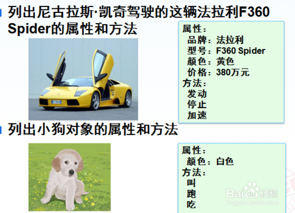

# 类和对象

**什么是类和对象？**

    在大家还没有学习类和对象的时候，基本上都是解决的一些比较简单的小程序，仅仅也就是几十行代码而已，如果你要开发的是一个很大的程序，需要用到几万行甚至是几十万行代码的量呢，如果把这么多的代码都放在一个文件夹中，可以想象的到，这个文件夹会非常的长，而且很难维护，因此就有了面向对象和类的设计，使之将重复抽象成一个类，从而减少了重复代码的编码。

## 一、对象，什么是对象呢？
    在现实生活中对象可谓是无处不在，如：一辆车、一把剪刀、一棵树 ... 当然了，这只是一个笼统的介绍。
    在程序中，对象就是用来描述客观事物的一个实体，有一组属性和方法构成。

## 二、类，什么又是类呢？
    在生活中我们也有许许多多的例子用啦描述类，比如：鸟、狗、猫我们称之为动物类。盘子、刀、案板、筷子我们称之为餐具类。
    在程序中，类是具有相同属性和服务的一组对象的集合。譬如，我们要定义一个人的类（那么这个人的名字、姓名、性别、住址 ... 我门都可以将它定义在同一个方法中，也就是实体类）

## 三、而类和对象又有什么关系呢？

举一个简单的列子吧！

列出尼古拉斯·凯奇驾驶的这辆法拉利F360 Spider的属性和方法

    属性：
    品牌：法拉利
    型号：F360 Spider
    颜色：黄色
    价格：380万元
    方法：
        发动
        停止
        加速

列出小狗对象的属性和方法
    属性： 
    颜色：白色
    方法：
        叫
        跑
        吃

## 总结：
    类是对象的抽象，对象是类的具体实例。
    类是抽象的，不占用内存，而对象是具体的，占有内存空间。
    例如：类就是水果，对象就是苹果。