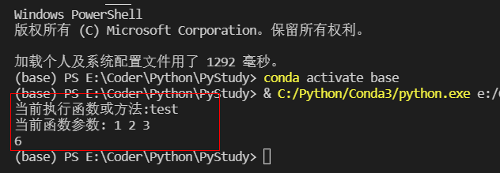

# 装饰器

## with装饰器

什么是装饰器呢？
举个例子，我们想要有一根过水的水管，现在我们想要监测这个水管的过水情况怎么办呢?
我们可以给这跟水管接上水表。

```py
def decorator_name(func):
    '''这里是装饰器1'''
    def wrapper(*args, **kwargs):
        print("当前执行函数或方法:{} ".format(func.__name__))
        print("当前函数参数:",*args, **kwargs)
        return func(*args, **kwargs)
    return wrapper

@decorator_name
def test(a,b,c):
    return a + b + c

d = test(1,2,3)
print(d)
```



我们可以看到在函数头上加上@语法糖，就能为函数装上 “装饰器”。
每次执行函数的时候就能触发装饰器里的语句。
就好像水表，经过的水都能通过水表报告出来。
我们这里的报告了

    当前执行函数或方法:test
    当前函数参数: 1 2 3

或者我们看看以下两个装饰器。
**参考代码：**
```py
import logging


def warning(func):
    '''警告日志打印装饰器'''
    def wrapper(*args, **kwargs):
        logging.warning("{} is running".format(func.__name__))
    return wrapper

def error(func):
    '''错误捕获装饰器'''
    def wrapper(*args, **kwargs):
        try:
            return func(*args, **kwargs)
        except Exception as e:
            return HttpResponse(e)
    return wrapper
```
## wrapt
wrapt模块的目的是提供一个透明的对象代理 对于python，它可以用作函数构造的基础 包装和装饰功能。

wrapt模块非常关注正确性。因此 超越现有机制，如functools.wraps()以确保 decorators保留内省、签名、类型检查功能 等。可以使用此模块构造的装饰器将在 比典型的装饰器提供更多的场景，并提供更可预测的 一贯的行为。

为了确保开销尽可能小，C扩展模块用于性能至关重要的组件。如果目标系统没有编译器来允许C扩展的编译，还可以提供对纯Python实现的自动回退。

pip安装wrapt包
```
pip install wrapt
```
**简单使用：**  
要实现装饰器，首先需要定义一个包装函数。每次调用修饰函数时都会调用此函数。包装函数需要四个位置参数：  
- wrapped-包装函数，包装函数依次需要调用它。
- instance-调用包装函数时绑定到的对象。
- args-调用修饰函数时提供的位置参数列表。
- kwargs-调用修饰函数时提供的关键字参数字典。

然后需要将decorator@wrapt.decorator应用于包装器 函数将其转换为decorator，而decorator又可以应用于其他功能。  
**示例：**
```py
import wrapt

@wrapt.decorator
def pass_through(wrapped, instance, args, kwargs):
    return wrapped(*args, **kwargs)

@pass_through
def function():
    pass

```
如果希望实现接受参数的decorator，请将 函数闭包中装饰器的定义。提供的任何参数 当decorator被应用时，将可用于 调用包装函数时的内部包装。
```py
import wrapt

def with_arguments(myarg1, myarg2):
    @wrapt.decorator
    def wrapper(wrapped, instance, args, kwargs):
        return wrapped(*args, **kwargs)
    return wrapper

@with_arguments(1, 2)
def function():
    pass
```

当应用于普通函数或静态方法时，包装器函数 调用时将传递None作为instance参数。  

当应用于实例方法时，调用的包装函数将调用方法的类的实例作为 instance参数。即使实例方法 通过类显式调用，实例作为第一个 instance。也就是说，实例永远不会作为args的一部分传递。  

当应用于类方法时，调用的包装函数将传递类类型作为instance参数。  
当应用于类时，将传递调用时的包装函数 None作为instance参数。这里的wrapped参数 凯斯将是全班同学。  
上面的规则可以用下面的例子来总结。  

```py
import inspect

@wrapt.decorator
def universal(wrapped, instance, args, kwargs):
    if instance is None:
        if inspect.isclass(wrapped):
            # Decorator was applied to a class.
            return wrapped(*args, **kwargs)
        else:
            # Decorator was applied to a function or staticmethod.
            return wrapped(*args, **kwargs)
    else:
        if inspect.isclass(instance):
            # Decorator was applied to a classmethod.
            return wrapped(*args, **kwargs)
        else:
            # Decorator was applied to an instancemethod.
            return wrapped(*args, **kwargs)
```


因此，使用这些检查可以创建一个通用的decorator 这可以应用于所有情况。不再需要创建 普通函数和实例方法的decorator的不同变体， 或者使用其他包装器将函数装饰器转换为 将适用于实例方法。

在所有情况下，传递给包装函数的包装函数都被调用 以同样的方式，传递args和kwargs。这个 instance参数不需要用于调用包装的 功能。  

**类的装饰器：**
```py
class JWTSignAuth(object):
    '''JWT签名认证-类的装饰器'''
    def __init__(self, cls):
        self._cls = cls

    def __call__(self, *args, **kwargs):
        this = self._cls(*args, **kwargs)
        if "Authorization" in request.headers:
            token = request.headers["Authorization"]
            payload = jwt.decode(token, SECRET_KEY, algorithms=['HS256'])
            
            if payload['sub'] != "login":
                raise answer.InvalidTokenError
            else:
                uid_stack.push(payload['uid'])
        else:
            raise answer.AuthorizationError
        return this
```

```py
@SignAuth
class Login(Resource):
    pass
```


