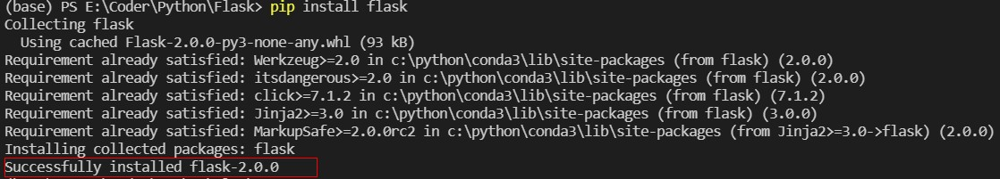
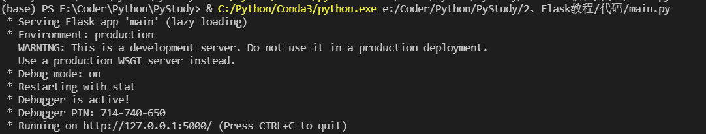
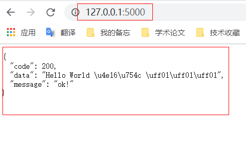

# 创建项目

flask其实是一个python的包。我们要基于flask的web开发，首先需要下载flask包。  
假设我们已经安装好了Python解释器，且配置好了环境。
执行以下命令
```sh
pip install flask 
```



我们看到 *Successfully installed flask-2.0.0* 这句提醒代表已经安装完成了。

现在我们创建我们的第一个项目：
```py
from flask import Flask,jsonify

app = Flask(__name__)

@app.route('/')
def hello():
    return jsonify({"code":200, "message":"ok!", "data":'Hello World 世界 ！！！'})

if __name__ == '__main__':
    app.run(debug=True)
```

点击执行，我们可以看到以下提醒



复制连接 http://127.0.0.1:5000/ 放在网页了尝试访问。（flask默认端口5000）



OK！我们的Flask就这样搭建起来了。