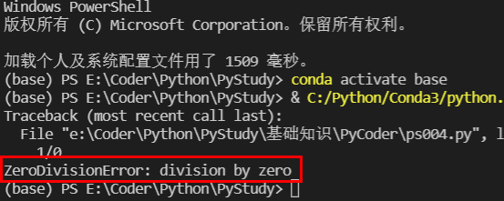
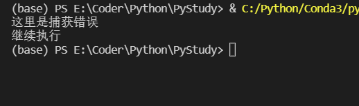
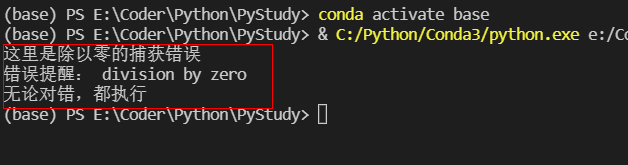

# 异常处理

## 什么是异常处理？异常处理有什么用？

    在数学里，我们都知道任何除以零是没有意义的。
    那如果在计数机里面出现这样的情况怎么办呢？
    直接宕机吗？
    还是退出测序呢？
    亦或者跳出提醒，程序继续执行，但是后续的代码怎么继续执行呢？
    我们看看以下是在python解释器执行得到的结果。



**代码：**
```py
1/0
print("继续执行")
```
    以上我们看到有一个“继续执行”的打印。但是并没有发生。那是因为我们在发生错误(Error)，程序就会直接退出(Exit)。那如果我们不希望退出，并且我们大约可以判断哪里会出错，该怎么办呢?

**代码：**
```py
try:
    1/0
except:
    print("这里是捕获错误")

print("继续执行")
```

    
    我们可以看到，发生错误时候我们就打印 “这里是捕获错误”，并且继续执行后续程序。
    下面我们写一个完全的错误捕获的结构体。
```py
try:

    1/0
except ZeroDivisionError as e:
    print("这里是除以零的捕获错误")
    print("错误提醒：",e)

except Exception as e:
    print("这里是其它所有类型错误")
    print("错误提醒：",e)
    
else:
    print("没有错误则执行这里")

finally:
    print("无论对错，都执行")
```




*Python异常处理语法：*

```py
try:
	...
except Exception1 as e1
	...
except Exception2 as e2:
	...
except Exception as e:
	...
else:
	...
finally:
	...
```

    如果try中有异常发生时，将执行异常的归属，执行except。
    异常层层比较，看是否是Exception1, Exception2...，直到找到其归属，执行相应的except中的语句。
    如果except后面没有任何参数，那么表示所有的Exception都交给这段程序处理

**实例1：**
```py
short_list = [1, 2, 3]
position = 5
try:
	short_list[position]
except IndexError as e:
	print('捕获到IndexError错误，错误提示为：' , e)
except Exception as e:
	print('Exception:', e)
```

**实例2：**
```py
try:
	1/0
except ZeroDivisionError as e:
	print('捕获到ZeroDivisionError错误，错误提示为：', e)
except Exception as e:
	print('Exception:', e)
```

**实例3：**
```py
try:
	a = 1
except:
	print('Exception:', e)
else:
	print('没有错误则执行这一句')
finally:
	print('无论如何都会执行这句的')
```
    如果try中没有异常，那么except部分将跳过，执行else中的语句。
    finally是无论是否有异常，最后都要做的一些事情。

*流程如下:*

    try -> 异常 -> except -> finally
    try -> 无异常 -> else -> finally


**常见异常:**
- NameError：尝试访问一个没有申明的变量
- ZeroDivisionError：除数为0
- SyntaxError：语法错误
- IndexError：索引超出序列范围
- KeyError：请求一个不存在的字典关键字
- IOError：输入输出错误（比如你要读的文件不存在）
- AttributeError：尝试访问未知的对象属性
- ValueError：传给函数的参数类型不正确，比如给int()函数传入字符串形
- Exception：其它错误（包含所有错误，上面预料不到的错误，它都能捕获到）