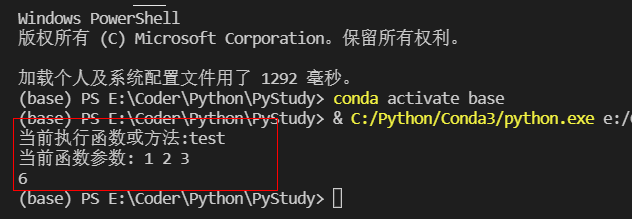

# 装饰器

什么是装饰器呢？
举个例子，我们想要有一根过水的水管，现在我们想要监测这个水管的过水情况怎么办呢?
我们可以给这跟水管接上水表。

```py
def decorator_name(func):
    '''这里是装饰器1'''
    def wrapper(*args, **kwargs):
        print("当前执行函数或方法:{} ".format(func.__name__))
        print("当前函数参数:",*args, **kwargs)
        return func(*args, **kwargs)
    return wrapper

@decorator_name
def test(a,b,c):
    return a + b + c

d = test(1,2,3)
print(d)
```



我们可以看到在函数头上加上@语法糖，就能为函数装上 “装饰器”。
每次执行函数的时候就能触发装饰器里的语句。

**参考代码：**
```py
import logging


def warning(func):
    '''警告日志打印装饰器'''
    def wrapper(*args, **kwargs):
        logging.warning("{} is running".format(func.__name__))
    return wrapper

def error(func):
    '''错误捕获装饰器'''
    def wrapper(*args, **kwargs):
        try:
            return func(*args, **kwargs)
        except Exception as e:
            return HttpResponse(e)
    return wrapper
```


