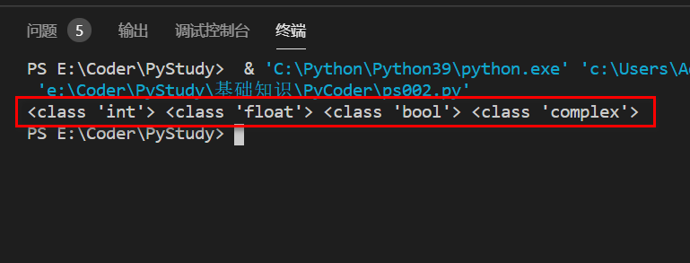

# Python 基础元素

    上节课我们完成了环境的的配置
    接下来我们一起来认识Python的基础元素
    今天我们创建第二个py文件，编写本节课的所有代码，以下执行都按上一节课见到的方法调试

## Python 基础数据类型

**Python 的六个基础数据类型：**

- Number（数字）
- String（字符串）
- List（列表）
- Tuple（元组）
- Sets（集合）
- Dictionary（字典）

### Number（数字）

    Python 数字类型包含 int（整数）、float（小数）、bool（真假数）、complex（复数）。
    内置的 type() 函数可以用来查询变量所指的对象类型。

**实例 1：**

```py
a, b, c, d = 20, 5.5, True, 4+3j
print(type(a), type(b), type(c), type(d))
```
**注意**
    
    “ = ” 在Python编程里是赋值的意思，即等号右边是要赋予的值，左边是被赋予的变量。如果要判断相等则用 “ == ”两个等号。


### String（字符串）

    Python 中的字符串用单引号(')或双引号(")括起来，同时使用反斜杠(\)转义特殊字符。
    字符串的截取的语法格式如下：
    变量[头下标:尾下标]
    索引值以 0 为开始值，-1 为从末尾的开始位置。
    加号 (+) 是字符串的连接符， 星号 (*) 表示复制当前字符串，紧跟的数字为复制的次数。

**实例 2：**

```py
str1 = 'hello world'
print (str1) # 输出字符串
print (str1[0:-1]) # 输出第一个至倒数第二个的字符
print (str1[0]) # 输出字符串的第一个字符
print (str1[2:5]) # 输出从第三个开始到第五个的字符
print (str1[2:]) # 输出从第三个开始的后的所有字符
print (str1 * 2) # 输出字符串两次
print (str1 + "！") # 连接字符串
```

### List（列表）

    List（列表） 是 Python 中使用最频繁的数据类型。
    列表可以完成大多数集合类的数据结构实现。列表中元素的类型可以不相同，它支持数字，字符串甚至可以包含列表。
    列表是写在方括号([])之间、用逗号分隔开的元素列表。
    和字符串一样，列表同样可以被索引和截取，列表被截取后返回一个包含所需元素的新列表。
    列表截取的语法格式如下：
    变量[下标:下标]
    索引值以 0 为开始值，-1 为从末尾的开始位置。
    加号（+）是列表连接运算符，星号（*）是重复操作。

**实例 3：**

```py
list1 = [ 'hello', 170 , 65.1, 'Shaun', 33]
tinylist = [123, 'eat']
print (list1) # 输出完整列表
print (list1[0]) # 输出列表第一个元素
print (list1[1:3]) # 从第二个开始输出到第三个元素
print (list1[2:]) # 输出从第三个元素开始的所有元素
print (tinylist * 2) # 输出两次列表
print (list1 + tinylist) # 连接列表
```

### Tuple（元组）

    元组（tuple）与列表类似，不同之处在于元组的元素不能修改。元组写在小括号 “ () ” 里，元素之间用逗号隔开。
    元组中的元素类型也可以不相同。

**实例 4：**

```py
tuple1 = ( 'hello', 170 , 65.1, 'Shaun', 33)
tinytuple = (123, 'eat')
print (tuple1) # 输出完整元组
print (tuple1[0]) # 输出元组的第一个元素
print (tuple1[1:3]) # 输出从第二个元素开始到第三个元素
print (tuple1[2:]) # 输出从第三个元素开始的所有元素
print (tuple1 * 2) # 输出两次元组
list1 = list(tuple1) # 元组转列表
```
**注解**
Python String（字符串）实际上是就是 Tuple元组。
### Set（集合）

    集合（set）是一个无序不重复元素的序列。
    基本功能是进行成员关系测试和删除重复元素。
    可以使用大括号 { } 或者 set() 函数创建集合，注意：创建一个空集合必须用 set() 而不是 { }，因为 { } 是用来创建一个空字典。
    创建格式：
    parameter = {value1,value2,value3,...}
    或者
    set(value)

**实例 5：**

```py
st1 = {'Tom', 'Jerry', 'Pite', 'Tom', 'Jack', 'Rose','Shaun'}
print(st1) # 输出集合，集合重复的元素被自动去掉

st2 = set({'Tom', 'Jerry', 'Pite', 'Tom', 'Jack', 'Rose','Shaun'})
print(st2) # 这里同等于上面
```

**是否存在**

```py
if 'Rose' in st2 :
    print('Rose 在集合中')
else :
    print('Rose 不在集合中')
```

**set 可以进行集合运算**

```py
a = set('abddabdc')
b = set('aakisgood')
print(a)
print(a - b) # a 和 b 的差集
print(a | b) # a 和 b 的并集
print(a & b) # a 和 b 的交集
print(a ^ b) # a 和 b 中不同时存在的元素
```

### Dictionary（字典）

    字典（dictionary）是 Python 中另一个非常有用的内置数据类型。
    列表是有序的对象结合，字典是无序的对象集合。两者之间的区别在于：字典当中的元素是通过键来存取的，而不是通过偏移存取。
    字典是一种映射类型，字典用"{ }"标识，它是一个无序的键(key) : 值(value)对集合。
    键(key)必须使用不可变类型。
    在同一个字典中，键(key)必须是唯一的。

**实例 6：**

```py
dict1 = {}
dict1['one'] = "strFirst"
dict1[2] = "numTwo"
print (dict1['one']) # 输出键为 'one' 的值
print (dict1[2]) # 输出键为 2 的值

dict2 = {'name': 'huaz','code':1, 'key2': 'value2'}
print (dict2) # 输出完整的字典
print (dict2.keys()) # 输出所有键
print (dict2.values()) # 输出所有值
```
