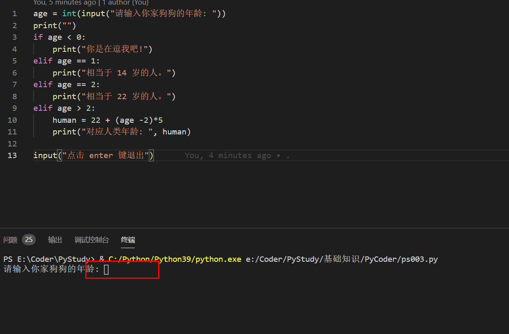

# Python条件控制

**Python条件控制语句一般如下（伪代码）：**
```py

if 逻辑状态1:
    执行语句1
elif 逻辑状态2:
    执行语句2
else:
    执行语句3
```
**逻辑说明**

    如果 "逻辑状态1" 为 True，将执行 "执行语句1" 块语句
    如果 "逻辑状态1" 为 False，将判断 "逻辑状态2"
    如果 "逻辑状态2" 为 True，将执行 "执行语句2" 块语句
    如果 "逻辑状态2" 为 False，将执行 "执行语句3" 块语句

    Python 中 elif 是 else if 编码方式，所以逻IF辑语句的关键字为：if – elif – else。

**注意：**

- 每个条件后面要使用冒号（:），表示接下来是满足条件后要执行的语句块。
- 使用缩进来划分语句块（一个缩进按一次Tab键），相同缩进数的语句在一起组成一个语句块。
- 在Python中没有switch – case语句。（没有任何其它编程基础的跳过不理）


**实例1：**
```py
a = True
if a:
    print('条件成立')
else:
    print('条件不成立')
```


**实例2：**
```py
var1 = 100
if var1:
    print ("var1表达式条件为 True")
    print ('var1 = ', var1)
 
var2 = 0
if var2:
    print ("var2 表达式条件为 True")
    print (var2)
else:
    print ("var2 表达式条件为 False")
    print ('var2 = ', var2)
```

**实例3：**
```py
age = int(input("请输入你家狗狗的年龄: "))
print("")
if age < 0:
    print("你是在逗我吧!")
elif age == 1:
    print("相当于 14 岁的人。")
elif age == 2:
    print("相当于 22 岁的人。")
elif age > 2:
    human = 22 + (age -2)*5
    print("对应人类年龄: ", human)

input("点击 enter 键退出")
```
- 这里注意输入数值在终端那里


**实例4：**
```py
number = 7
guess = -1
print("数字猜谜游戏!")
while guess != number:
    guess = int(input("请输入你猜的数字："))
    if guess == number:
        print("恭喜，你猜对了！")
    elif guess < number:
        print("猜的数字小了...")
    elif guess > number:
        print("猜的数字大了...")
```


**实例5：**
```py
num=int(input("输入一个数字："))
if num%2==0:
    if num%3==0:
        print ("你输入的数字可以整除 2 和 3")
    else:
        print ("你输入的数字可以整除 2，但不能整除 3")
else:
    if num%3==0:
        print ("你输入的数字可以整除 3，但不能整除 2")
    else:
        print  ("你输入的数字不能整除 2 和 3")
```